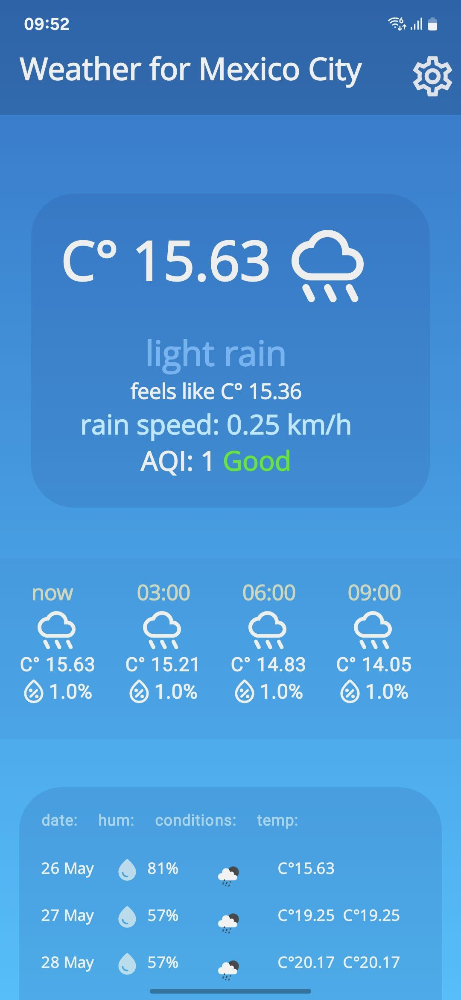
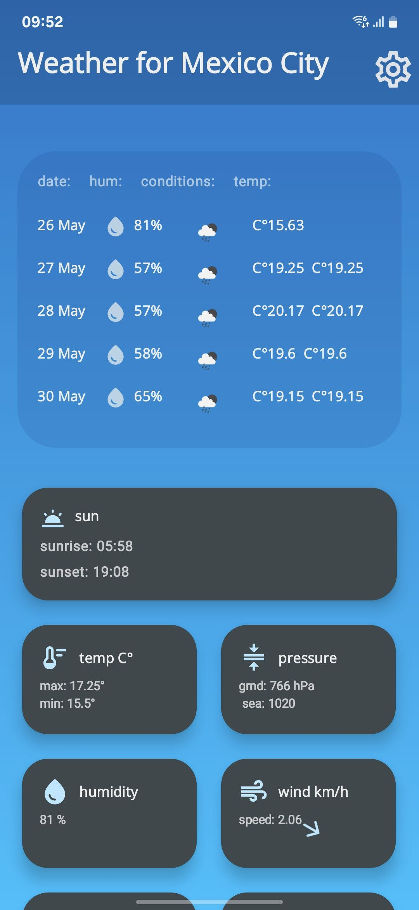
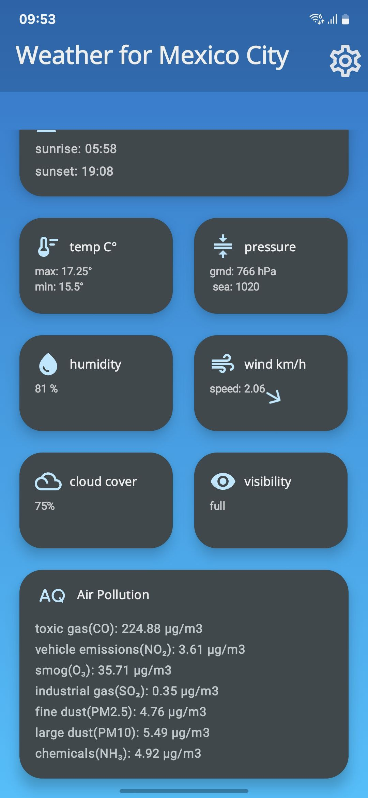
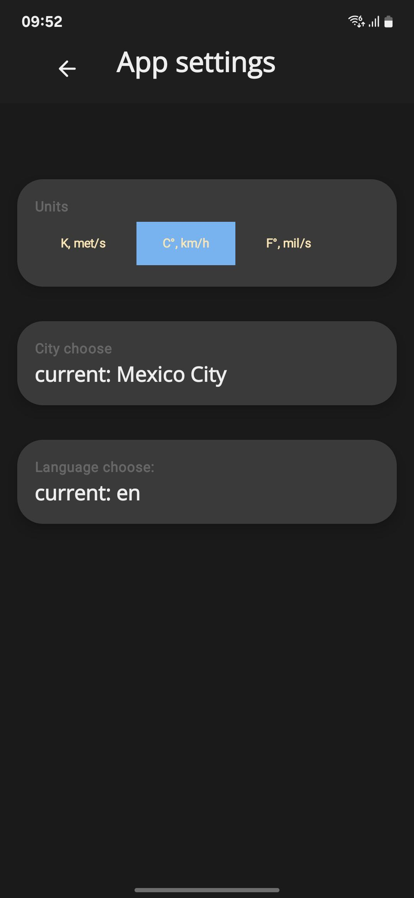

# Weather Display App README

## About The Project

This is a minimalistic Android weather display application designed to show current weather conditions. The app 
allows users to switch between different temperature units (Celsius, Fahrenheit, and Kelvin) and view wind speed 
measurements in various formats. It also supports language switching between Russian and English.

()
()
()
<div style="display: flex; gap: 10px; align-items: center;">
  
  
  
  
</div>

  
The app is built using:

- **Kotlin** - For the modern Android development experience
- **Jetpack Compose** - For declarative UI components
- **Retrofit** - For handling HTTP requests
- **DataStorePreferences** - For user preferences storage
- **Open Wather Api** - For weather data 

## Getting Started

### Prerequisites

To run this project, you'll need:

- **Android Studio** (latest version recommended)
- **Kotlin** (latest version recommended)
- **Jetpack Compose** (part of Android Studio)
- **Retrofit** (for API calls)
- **Open weather api key** (to obtain weather data)

### Installation

1. Clone the repository:
   ```bash
   git clone https://github.com/GAZIZlikesLollipop/WeatherApp.git
   ```
   or in Android Studio
2. Open the project in Android Studio
3. Add your API key to `data/model/WeatherRepositry.kt` depending on your setup
4. Run the app using the `run` command or by clicking the green play button

## Usage

1. The app displays current weather conditions on the main screen.
2. Use the settings screen to:
   - Change temperature unit (Celsius, Fahrenheit, Kelvin)
   - Change language between Russian and English
3. Save your preferences and they will persist across app restarts

## Contributing

Contributions are welcome! If you'd like to contribute, please follow these steps:

1. Fork the repository
2. Create a feature branch (`git checkout -b feature/your-feature-name`)
3. Commit your changes
4. Push to your branch
5. Open a Pull Request

Please make sure to follow the existing code style and add comments where necessary.

## Contact

Project Link: 
[https://github.com/GAZIZlikesLollipop/WeatherApp](https://github.com/GAZIZlikesLollipop/WeatherApp)

## Acknowledgments

- **Jetpack Compose**: For the beautiful UI components
- **Retrofit**: For handling HTTP requests efficiently
- **SharedPreferences**: For user preferences storage
- **Font Awesome Icons**: Used throughout the app
- **Open Weather Api**: Api for getting weather data

This README provides a basic overview of the project. Please refer to individual documentation for detailed 
information on specific aspects.
